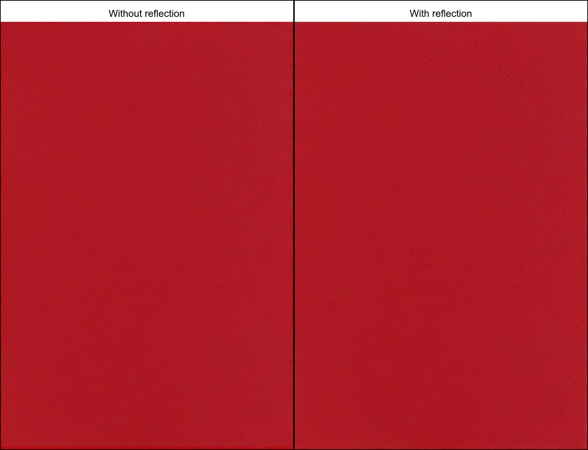
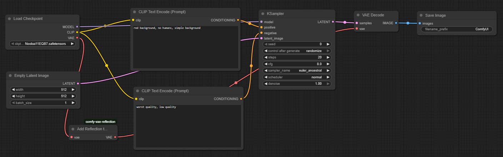

# ComfyUI VAE Reflection

A simple custom node that modifies the padding mode of the conv layers of the VAE to use reflect mode. This is used to fix artifacts in the edges of the images.
<br/>
**Warning:** If the VAE in use does not create artifacts in the edges applying the reflection mode can cause issues in the edges.
<br/>
<br/>
Here's a side to side comparison, if can't see the difference try to zoom in bottom left corner of both images and compare them.

> Tested with [Anzhc's EQ VAE](https://huggingface.co/Anzhc/MS-LC-EQ-D-VR_VAE)

You can integrate this node in your workflow very easily like shown in the picture below.


## Installation
Download it using the [ComfyUI Registry](https://registry.comfy.org/nodes/comfyui-vae-reflection).

### Manual Install
Clone the repository into the Comfy's `custom_nodes` directory with this command:
```
git clone https://github.com/Jelosus2/comfyui-vae-reflection
```
and restart ComfyUI.

## License

MIT License

Copyright (c) 2025 Jelosus1

Permission is hereby granted, free of charge, to any person obtaining a copy of this software and associated documentation files (the "Software"), to deal in the Software without restriction, including without limitation the rights to use, copy, modify, merge, publish, distribute, sublicense, and/or sell copies of the Software, and to permit persons to whom the Software is furnished to do so, subject to the following conditions:

The above copyright notice and this permission notice shall be included in all copies or substantial portions of the Software.

THE SOFTWARE IS PROVIDED "AS IS", WITHOUT WARRANTY OF ANY KIND, EXPRESS OR IMPLIED, INCLUDING BUT NOT LIMITED TO THE WARRANTIES OF MERCHANTABILITY, FITNESS FOR A PARTICULAR PURPOSE AND NONINFRINGEMENT. IN NO EVENT SHALL THE AUTHORS OR COPYRIGHT HOLDERS BE LIABLE FOR ANY CLAIM, DAMAGES OR OTHER LIABILITY, WHETHER IN AN ACTION OF CONTRACT, TORT OR OTHERWISE, ARISING FROM, OUT OF OR IN CONNECTION WITH THE SOFTWARE OR THE USE OR OTHER DEALINGS IN THE SOFTWARE.